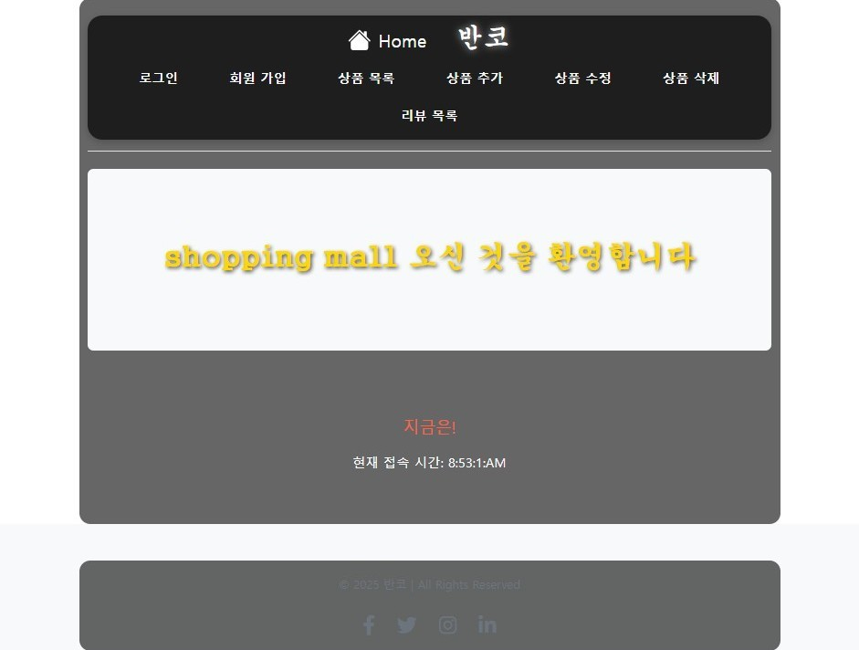
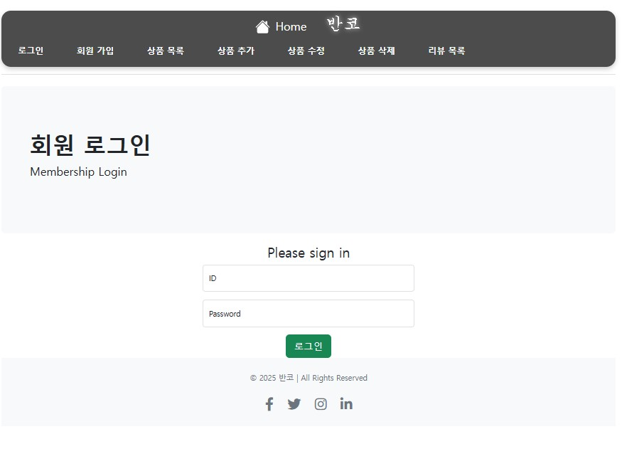
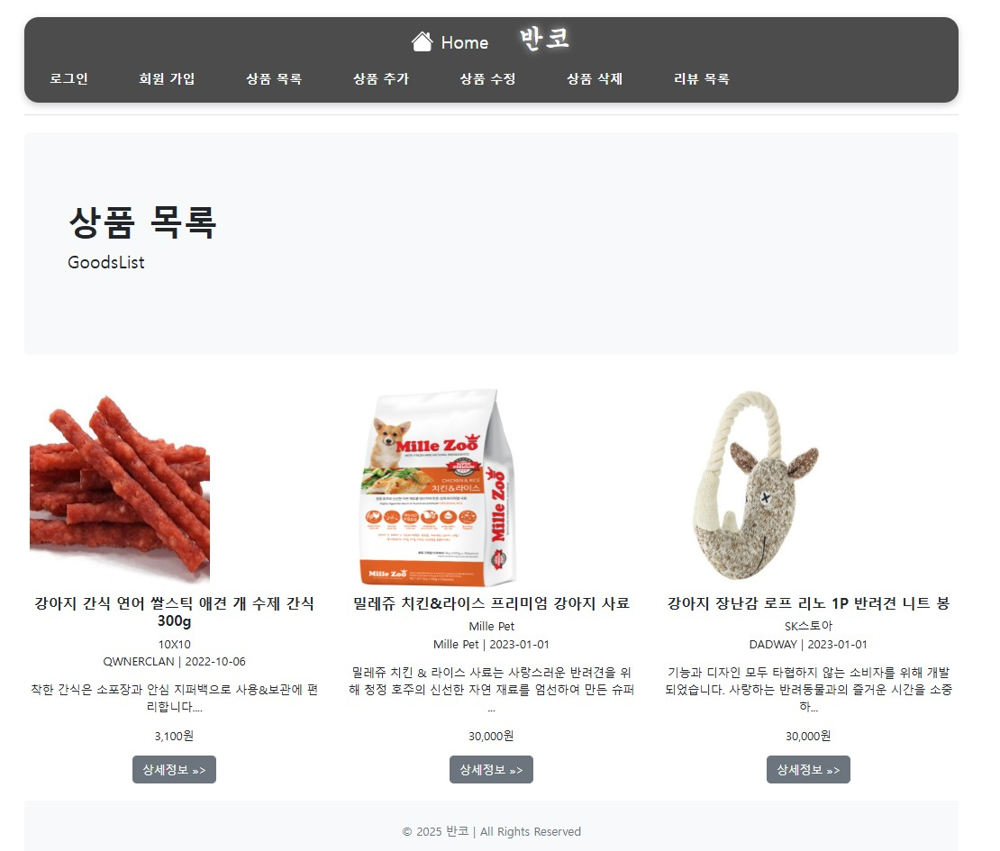
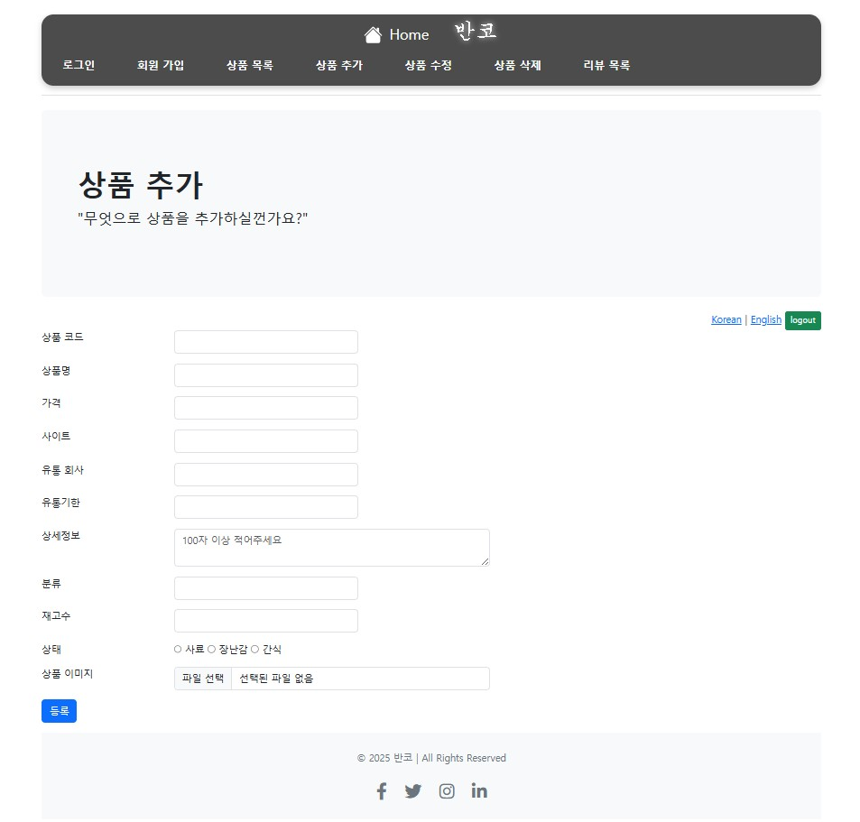
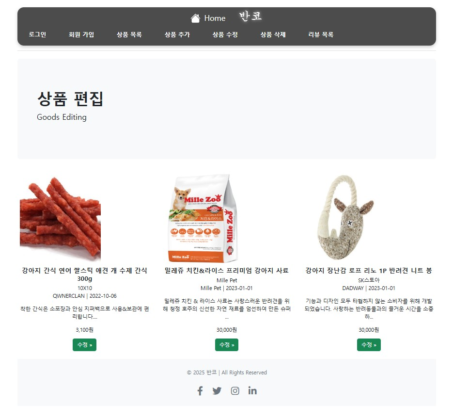

# 🐾 반려동물 온라인 쇼핑몰 프로젝트

**기간**: 2025.03.20 ~ 2025.04.25

## 📌 프로젝트 개요
- 주제 선정 및 자료 수집
- 간트 차트 작성
- 기술 스택 선정
- DB 설계 및 테스트

## 📊 펫코노미란?
**펫코노미(Pet + Economy)**는 반려동물 관련 산업의 성장으로 형성된 경제 현상입니다. 사료, 장난감, 의료, 보험, 펫 호텔 등 다양한 서비스가 포함되며, 반려동물을 가족처럼 여기는 문화와 함께 계속 성장하고 있습니다.

## 📈 반려동물 시장 데이터
- 2022년 기준 국내 반려가구: 552만 가구 (25.7%)
- 2023년 반려동물 양육 인구 비율: **28.2%**
- 2022년 반려동물 시장 규모: 약 8조 원
- 온라인 거래액 증가: 2019년 대비 241% 증가
- 2024년 온라인 채널 비중: **70%**

## 🖼️ 프로젝트 포스터

## 📅 개인프로젝트 간트 차트
-001.png)

## 🛠️ 사용 기술 스택
  
Java, JavaScript, CSS 등을 사용해 구현했습니다.

## 🧪 DB 설계 및 테스트 결과
아래는 수정 전/후 비교입니다.

### 홈 화면
- .jpg)
- 

### 로그인 페이지
- .jpg)
- 

### 회원가입
- .jpg)
- 

### 상품목록
- .jpg)
- 

### 상품등록
- .jpg)
- 

### 상품 편집

### 리뷰 화면

## 📌 더 많은 기능은 향후 추가 예정입니다.
