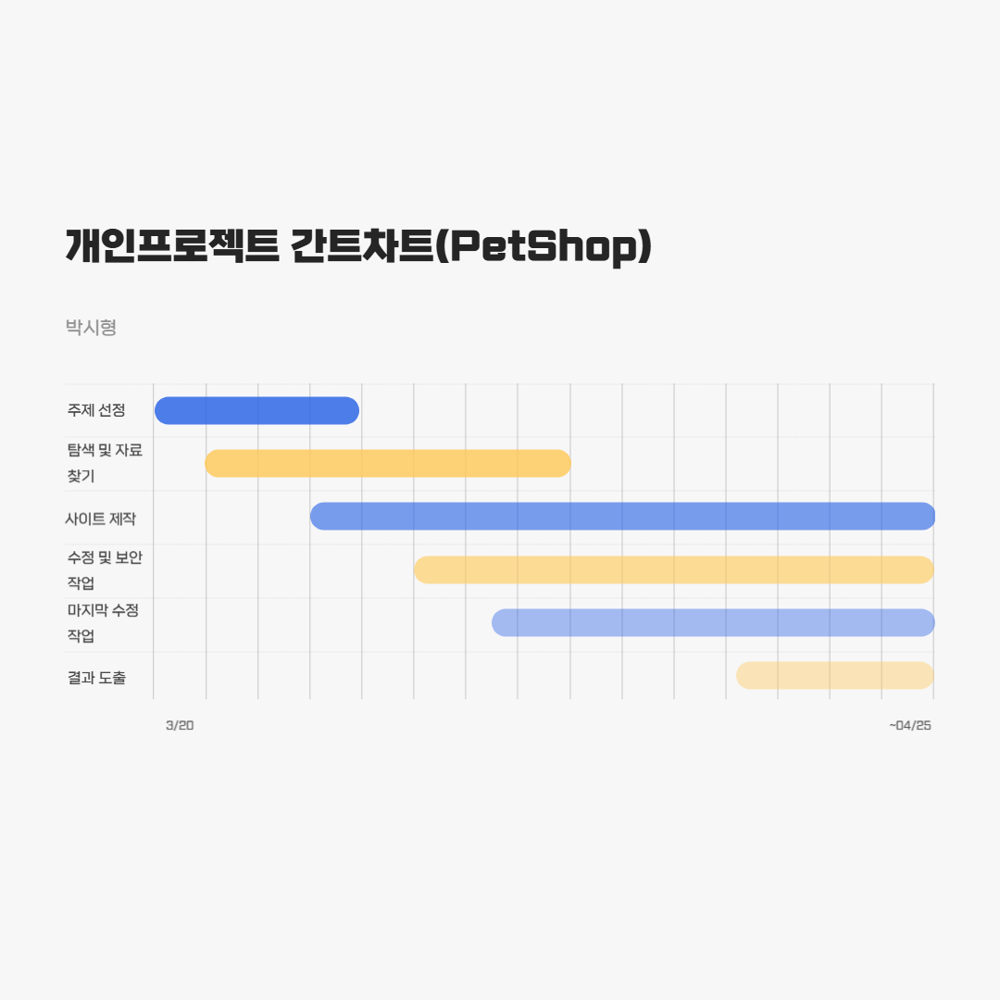
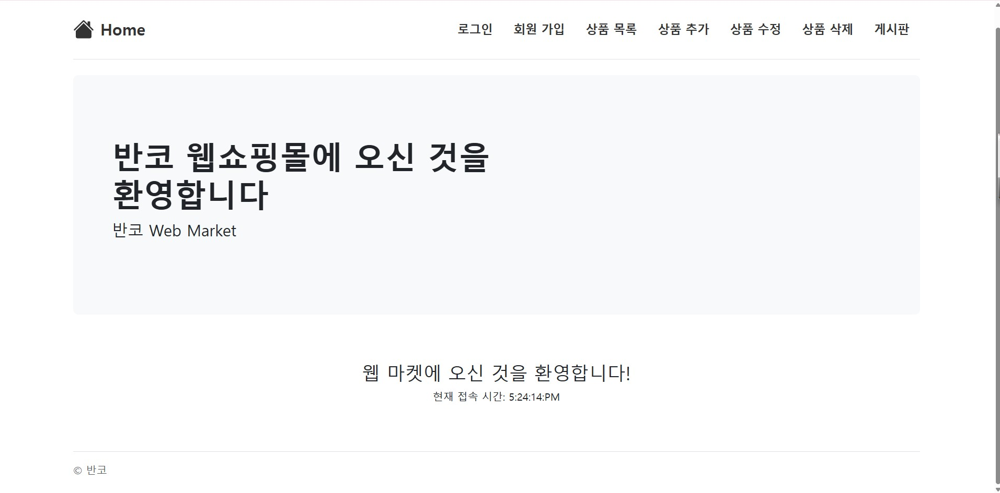
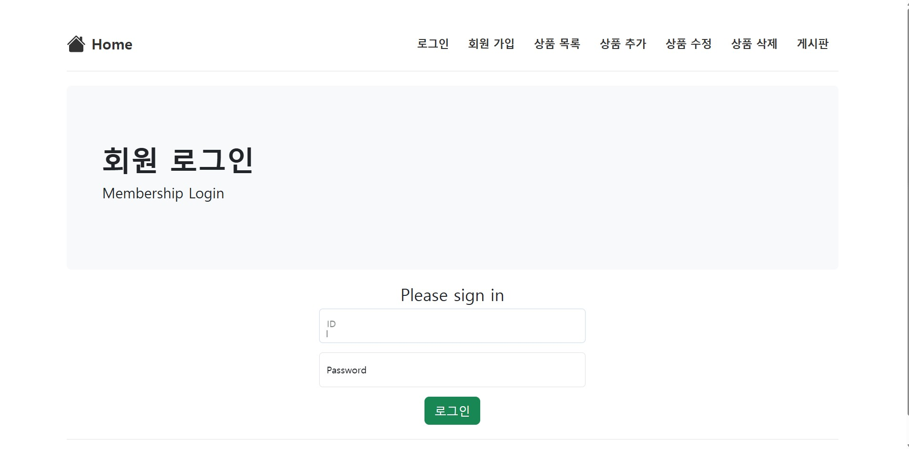
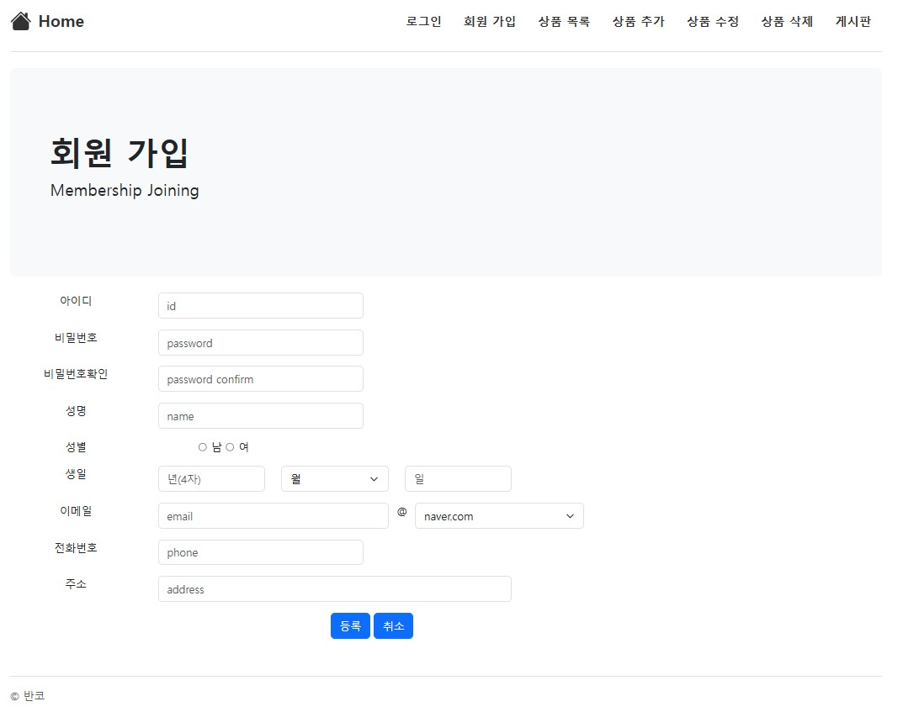
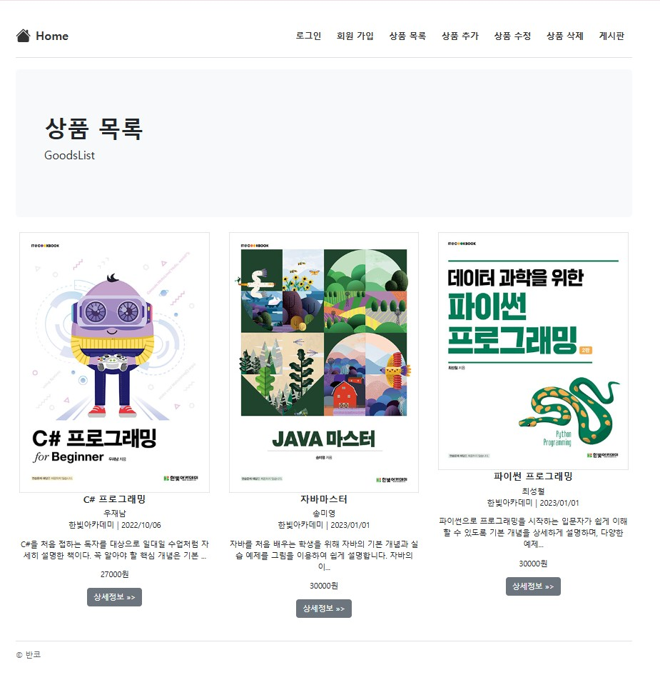
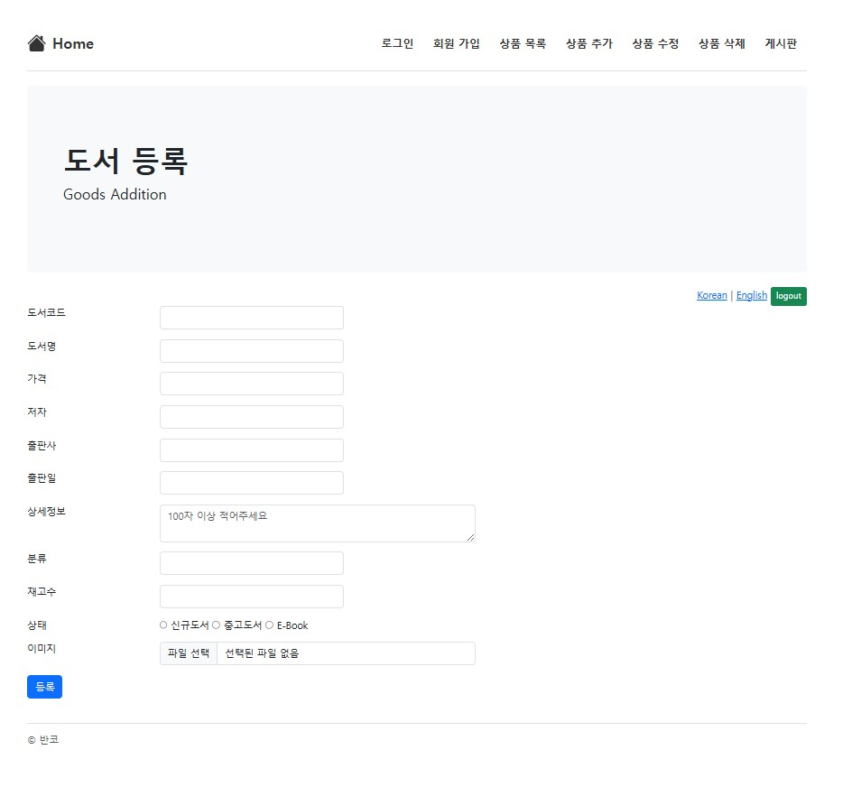

<!DOCTYPE html>
<html lang="ko">
<head>
  <meta charset="UTF-8" />
  <meta name="viewport" content="width=device-width, initial-scale=1.0" />
  <title>반려동물 쇼핑몰 프로젝트</title>
  <link href="https://fonts.googleapis.com/css2?family=Nanum+Gothic&display=swap" rel="stylesheet">
  
</head>
<body>

  <h1>🐾 반려동물 온라인 쇼핑몰 프로젝트</h1>
  
<strong>기간:</strong> 2025.03.20 ~ 2025.04.25

  

    <h2>📌 프로젝트 개요</h2>
    <ul>
      <li>주제 선정 및 자료 수집</li>
      <li>간트 차트 작성</li>
      <li>기술 스택 선정</li>
      <li>DB 설계 및 테스트</li>
    </ul>
  

  

    <h2>📊 펫코노미란?</h2>
    
<strong>펫코노미(Pet + Economy)</strong>는 반려동물 관련 산업의 성장으로 형성된 경제 현상입니다. 사료, 장난감, 의료, 보험, 펫 호텔 등 다양한 서비스가 포함되며, 반려동물을 가족처럼 여기는 문화와 함께 계속 성장하고 있습니다.

  

  

    <h2>📈 반려동물 시장 데이터</h2>
    <ul>
      <li>2022년 기준 국내 반려가구: 552만 가구 (25.7%)</li>
      <li>2023년 반려동물 양육 인구 비율: <strong>28.2%</strong></li>
      <li>2022년 반려동물 시장 규모: 약 8조 원</li>
      <li>온라인 거래액 증가: 2019년 대비 241% 증가</li>
      <li>2024년 온라인 채널 비중: <strong>70%</strong></li>
    </ul>
  

  

    <h2>🖼️ 프로젝트 포스터</h2>
    
  

  

    <h2>📅 개인프로젝트 간트 차트</h2>
    
  

  

    <h2>🛠️ 사용 기술 스택</h2>
    
    
Java, JavaScript, CSS 등을 사용해 구현했습니다.

  

  

    <h2>🧪 DB 설계 및 테스트 결과</h2>
    
아래는 수정 전/후 비교입니다.

    <h3>홈 화면</h3>
    
    

    <h3>로그인 페이지</h3>
    
    

    <h3>회원가입</h3>
    
    

    <h3>상품목록</h3>
    
    

    <h3>상품등록</h3>
    
    

    <h3>상품 편집</h3>
    

    <h3>리뷰 화면</h3>
    
  

  <footer>
    
📌 더 많은 기능은 향후 추가 예정입니다.

  </footer>
</body>
</html>
