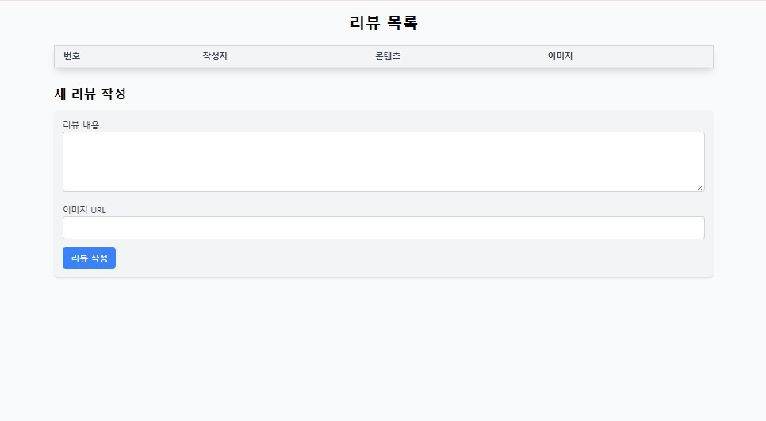

# Save the refined README content to a .md (Markdown) file

readme_content = """
# 🐾 반려동물 온라인 쇼핑몰 프로젝트

**📅 기간**: 2025.03.20 ~ 2025.04.25  
**🛠️ 기술 스택**: Java, JSP, JavaScript, HTML/CSS, MySQL

---

## 📌 프로젝트 개요

- 반려동물 쇼핑몰을 주제로 한 웹 프로젝트  
- 사용자 중심의 직관적인 UI 설계  
- JSP 기반 백엔드와 MySQL DB 연동  
- 로그인, 회원가입, 상품 관리, 리뷰 기능 등 전자상거래 핵심 기능 구현

---

## 📊 펫코노미란?

> **펫코노미(Pet + Economy)**는 반려동물 관련 산업이 성장하며 형성된 새로운 소비 경제입니다.  
사료, 장난감, 의료, 보험, 펫 호텔 등 다양한 분야가 포함되며,  
반려동물을 가족처럼 여기는 문화 확산과 함께 지속적으로 성장하고 있습니다.

---

## 📈 반려동물 시장 데이터

- ✅ 2022년 기준 국내 반려가구: **552만 가구 (25.7%)**  
- ✅ 2023년 반려동물 양육 인구 비율: **28.2%**  
- ✅ 2022년 반려동물 시장 규모: **약 8조 원**  
- ✅ 온라인 거래액 증가율 (2019 대비): **241% 증가**  
- ✅ 2024년 예상 온라인 채널 비중: **70%**

---

## 🖼️ 프로젝트 포스터

---

## 📅 프로젝트 일정 (간트 차트)

-001.png)

---

## 🛠️ 사용 기술 스택

  
**Java**, **JSP**, **JavaScript**, **HTML/CSS**, **MySQL**

---

## 🧪 DB 설계 및 기능 테스트 결과

### 🏠 홈 화면
- **수정 전**: 단순한 구조  
  .jpg)
- **수정 후**: 추천 상품과 메뉴 구조를 개선하여 사용자 접근성 향상  
  

---

### 🔐 로그인 페이지
- **수정 전**: 입력 검증 부족 및 단조로운 디자인  
  .jpg)
- **수정 후**: 오류 메시지 처리 추가 및 UI 개선  
  

---

### 📝 회원가입 페이지
- **수정 전**: 필수 항목 누락 시 처리 미흡  
  .jpg)
- **수정 후**: 유효성 검사, 입력 안내 메시지 추가  
  

---

### 🛍️ 상품 목록
- **수정 전**: 단순 나열식 구성  
  .jpg)
- **수정 후**: 이미지 카드 레이아웃 적용 및 필터링 기능 추가  
  

---

### ➕ 상품 등록
- **수정 전**: 기능은 있으나 UI 단조롭고 미리보기 없음  
  .jpg)
- **수정 후**: 이미지 업로드 미리보기 및 카테고리 분류 적용  
  

---

### ✏️ 상품 편집

- 등록된 상품에 대해 이름, 가격, 설명 등을 수정 가능  
  

---

### ⭐ 리뷰 화면

- 사용자 리뷰 등록 및 별점 기반 평가 표시  
  

---

## 🔄 향후 개선 및 확장 예정 기능

- 관리자 전용 상품 및 회원 관리 대시보드  
- 사용자 주문 내역 조회 및 배송 추적 기능  
- 지도 기반 반려동물 병원/샵 추천 기능  
- 인기 상품/리뷰 통계 및 차트 시각화  
- 반응형 UI 개선 및 모바일 지원

---

## ✅ 요약 정보

| 항목 | 내용 |
|------|------|
| 🧩 프로젝트 유형 | 개인 프로젝트 |
| 💻 주요 기술 | Java, JSP, HTML/CSS, JavaScript, MySQL |
| 🔍 구현 기능 | 로그인, 회원가입, 상품 관리, 리뷰 등록 등 |
| 📈 개발 목표 | 반려동물 기반 전자상거래 웹사이트 구축 |
| 📆 개발 기간 | 2025.03.20 ~ 2025.04.25 |

---

📌 **참고**  
기능별로 UI/UX 및 구조 개선을 지속 중이며, 향후 배포용 리팩토링 및 팀 프로젝트로 확장할 계획입니다.
"""

# Save to file
file_path = "/mnt/data/PetShop_Project_README.md"
with open(file_path, "w", encoding="utf-8") as file:
    file.write(readme_content)

file_path
