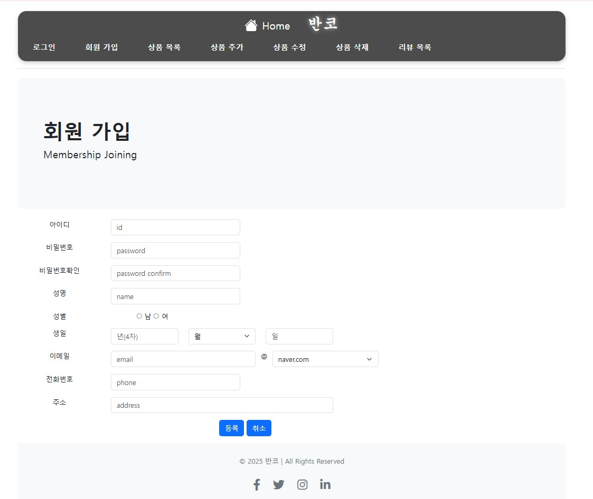

# 🐾 반려동물 온라인 쇼핑몰 프로젝트

**📅 기간**: 2025.03.20 ~ 2025.04.25  
**🛠️ 기술 스택**: Java, JSP, JavaScript, HTML/CSS, MySQL  

---

## 📌 프로젝트 개요

- 반려동물 쇼핑몰을 주제로 한 **전자상거래 웹 프로젝트**
- 사용자 중심의 **직관적인 UI 설계**
- **JSP 기반 백엔드**와 **MySQL 데이터베이스** 연동
- 로그인, 회원가입, 상품 관리, 리뷰 등 **전자상거래 핵심 기능 구현**

---

## 📊 펫코노미란?

> **펫코노미(Pet + Economy)**는 반려동물 관련 산업이 성장하며 형성된 새로운 소비 경제입니다.  
> 사료, 장난감, 의료, 보험, 펫 호텔 등 다양한 분야가 포함되며,  
> 반려동물을 가족처럼 여기는 문화 확산과 함께 지속적으로 성장하고 있습니다.

---

## 📈 반려동물 시장 데이터 (2025년 기준)

| 항목 | 내용 |
|------|------|
| ✅ 국내 반려가구 | 600만 가구 (27.5%) |
| ✅ 반려동물 양육 인구 비율 | 30.1% |
| ✅ 반려동물 시장 규모 | 약 9조 원 |
| ✅ 온라인 거래액 증가율 (2020 대비) | 265% 증가 |
| ✅ 예상 온라인 채널 비중 | 75% |
| ✅ 용품 및 서비스 소비 증가율 | 연평균 12% 증가 |
| ✅ 반려동물 보험 가입률 | 11% |
| ✅ 소형 동물 인기 | 반려묘 및 소형견 선호도 증가 |
| ✅ 펫 푸드 시장 규모 | 5조 원 이상 |
| ✅ 펫케어 및 미용 서비스 성장률 | 연평균 15% |
| ✅ 온라인 쇼핑몰 활용 증가 | 소형, 특수 견종 및 고급 품목 수요 증가 |

---

## 🖼️ 프로젝트 포스터

  

---

## 📅 프로젝트 일정 (간트 차트)

  

---

## 🛠️ 사용 기술 스택

  

Java, JSP, JavaScript, HTML/CSS, MySQL

  

---

## 🧪 DB 설계 및 기능 테스트 결과

### 🏠 홈 화면
- **수정 전**: 단순한 구조로 콘텐츠가 부족하고 상품 접근성이 떨어짐  
- **수정 후**: 추천 상품과 카테고리 기반 메뉴 구조를 도입하여 사용자 접근성 향상  

| 수정 전 | 수정 후 |
|---------|---------|
| .jpg) |  |

---

### 🔐 로그인 페이지
- **수정 전**: 입력 오류에 대한 검증 부족, 직관적이지 않은 UI  
- **수정 후**: 유효성 검사, 오류 메시지 출력, 버튼 스타일 개선  

| 수정 전 | 수정 후 |
|---------|---------|
| .jpg) |  |

---

### 📝 회원가입 페이지
- **수정 전**: 필수 입력 항목 누락 시 오류 처리 미흡  
- **수정 후**: 각 항목에 유효성 검사를 적용하고 안내 메시지를 추가  

| 수정 전 | 수정 후 |
|---------|---------|
| .jpg) |  |

---

### 🛍️ 상품 목록
- **수정 전**: 단순 나열식 상품 배열로 사용자 흥미 유발 부족  
- **수정 후**: 이미지 카드 레이아웃 적용, 카테고리 필터 기능 추가  

| 수정 전 | 수정 후 |
|---------|---------|
| .jpg) |  |

---

### ➕ 상품 등록
- **수정 전**: 이미지 미리보기 및 카테고리 설정 기능 없음  
- **수정 후**: 이미지 업로드 시 미리보기 제공, 카테고리 선택 UI 추가  

| 수정 전 | 수정 후 |
|---------|---------|
| .jpg) |  |

---

### ✏️ 상품 편집
- **기능 설명**: 등록된 상품의 이름, 가격, 설명 등을 관리자 계정에서 직접 수정 가능  

---

### ⭐ 리뷰 화면
- **기능 설명**: 사용자는 별점과 함께 상품에 대한 리뷰를 남길 수 있으며, 별점 평균을 통해 상품 평가 확인 가능  

---

## 🔄 향후 개선 및 확장 예정 기능

- 📦 **관리자 전용** 상품 및 회원 관리 대시보드
- 🧾 **사용자 주문 내역 조회 및 배송 추적**
- 🗺️ **지도 기반** 반려동물 병원/샵 추천 기능
- 📊 **인기 상품/리뷰 통계 및 시각화**
- 📱 **반응형 UI** 개선 및 모바일 최적화

---

## ✅ 요약 정보

| 항목 | 내용 |
|------|------|
| 🧩 프로젝트 유형 | 개인 프로젝트 |
| 💻 주요 기술 | Java, JSP, HTML/CSS, JavaScript, MySQL |
| 🔍 구현 기능 | 로그인, 회원가입, 상품 관리, 리뷰 등록 등 |
| 📈 개발 목표 | 반려동물 기반 전자상거래 웹사이트 구축 |
| 📆 개발 기간 | 2025.03.20 ~ 2025.04.25 |

---

## 📌 참고 사항

- 기능별로 **UI/UX 및 구조 개선**을 지속 중입니다.
